# Kütüphane Otomasyonu

Bu kütüphane otomasyonu,kitapların yönetimi ve erişimini kolaylaştırmak amacıyla geliştirilmiştir.Kullanıcı dostu arayüzü ve işlevsel özellikleriyle kütüphane personelinin ve kullanıcıların ihtiyaçlarına yönelik bir çözüm sunmayı hedeflemektedir. *C# Windows Forms Application* kullanılarak yapılmıştır.

## Ekran Görüntüleri

## Kütüphane otomasyonu giriş arayüzü:
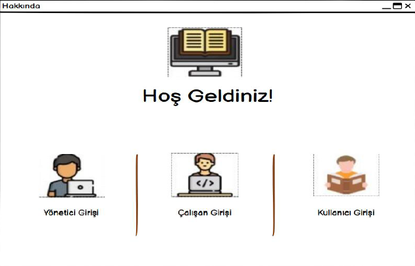
## Çalışan giriş arayüzü:
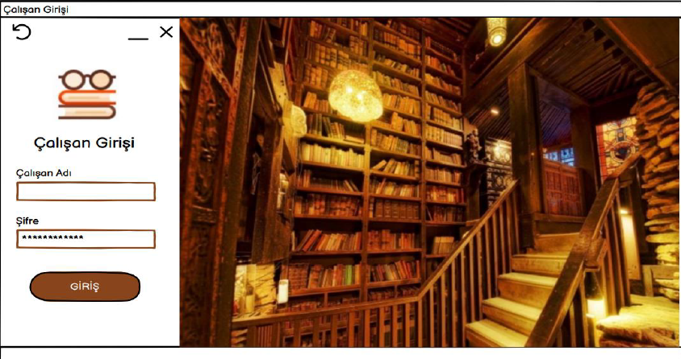
## Çalışan girişi anasayfa arayüzü:
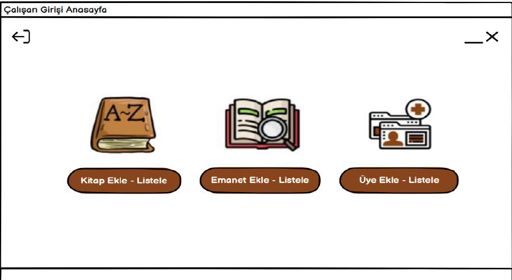
## Kitap ekle-listele arayüzü:
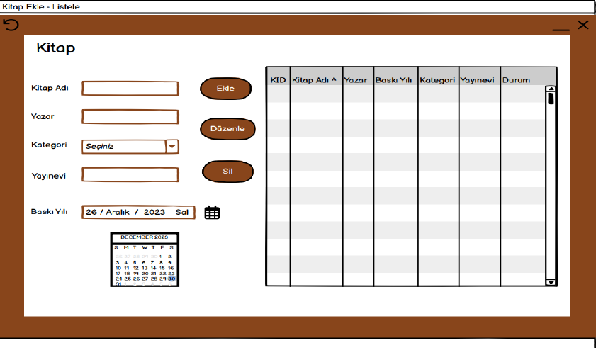
## Emanet ekle-listele arayüzü:
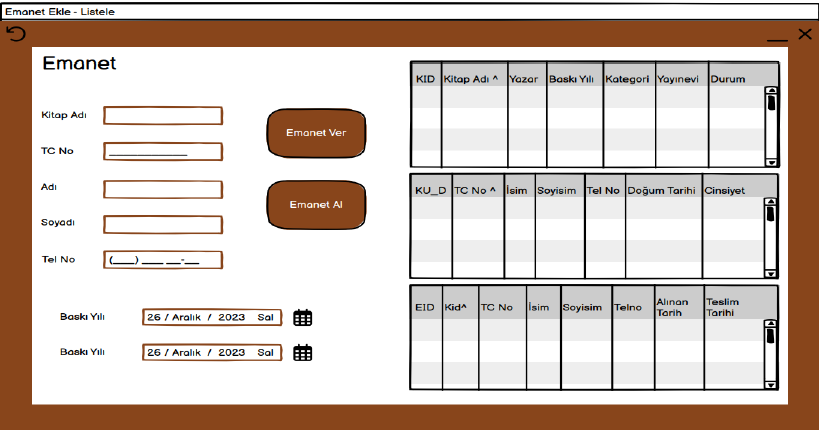
## Kullanıcı ekle-listele arayüzü:
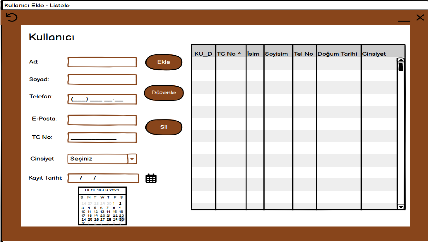
## Yönetici giriş arayüzü:
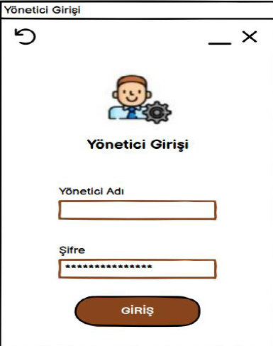
## Yönetici girişi anasayfa arayüzü:
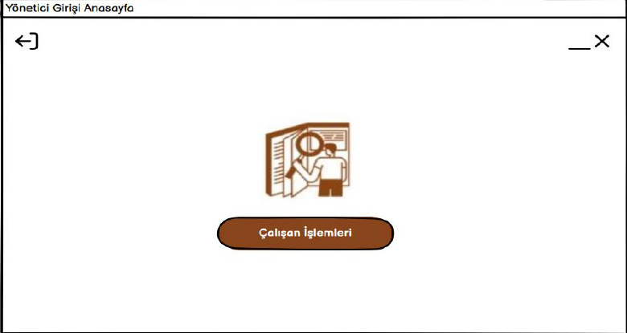
## Çalışan işlemleri arayüzü:
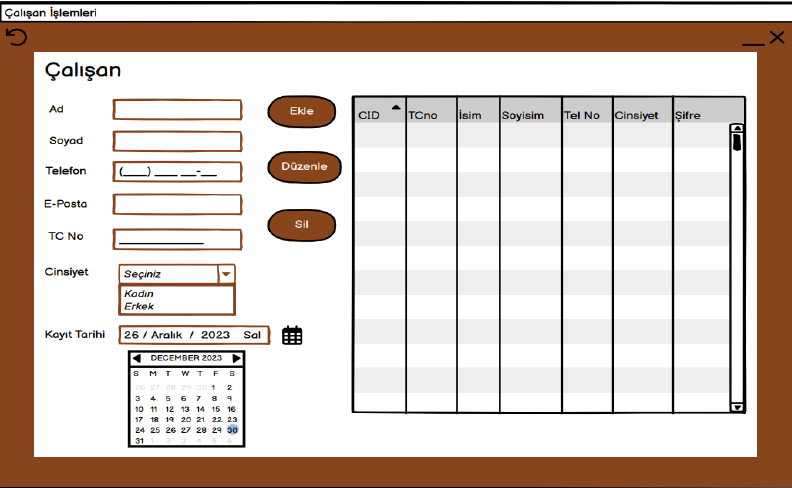
## Kullanıcı girişi arayüzü:
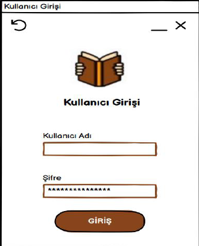
## Kullanıcı girişi anasayfa arayüzü:
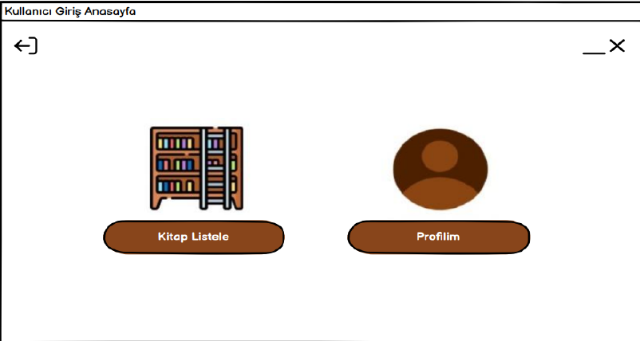
## Kullanıcı kitap listele arayüzü:
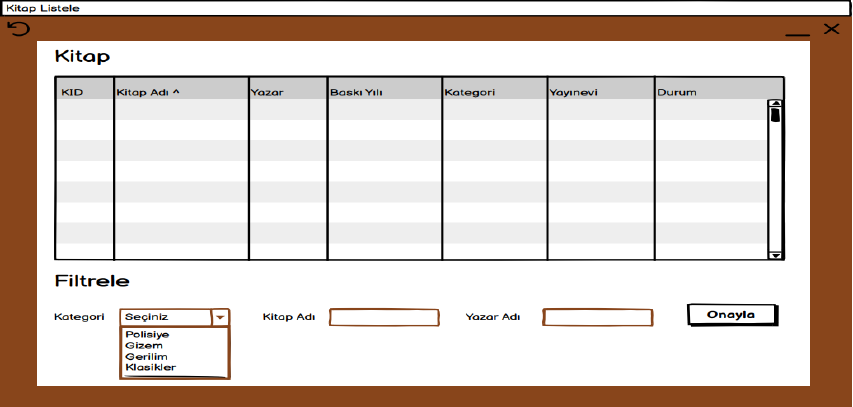
## Kullanıcı profil arayüzü:
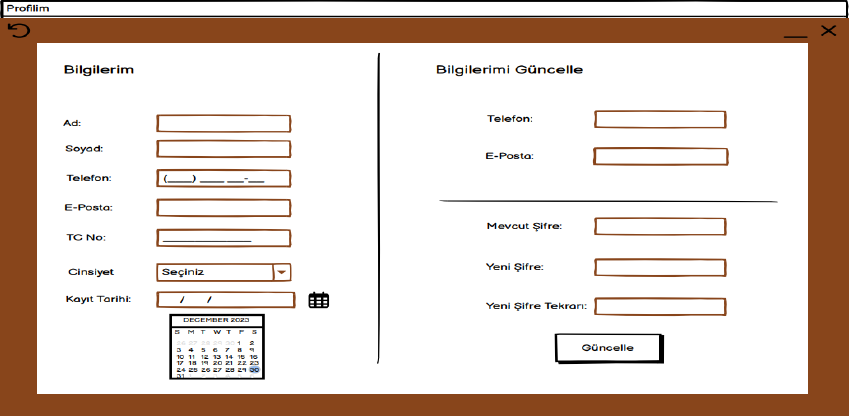

### Gereksinimler

- *Visual Studio 2022* veya daha güncel sürüm
- *.NET Framework *
- *SQL Server* (Veritabanı için)

## Lisans
Bu proje [MIT Lisansı](LICENSE) altında lisanslanmıştır.
